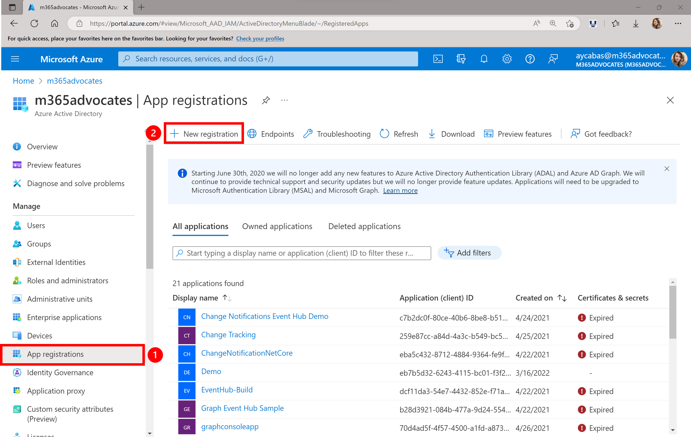
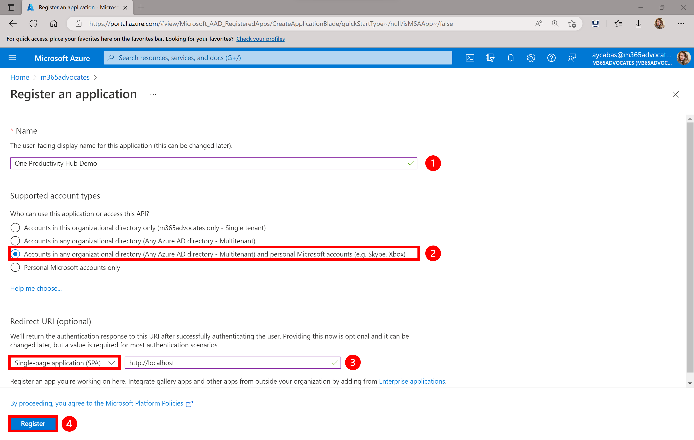

## Part 2 - Register your application in Azure Active Directory

- [Part 0 - Environment Setup](/Labs/00-Setup.md)
- [Part 1 - Create a new web app](/Labs/01-Create_new_app.md)
- [Part 2 - Register your application in Azure Active Directory](/Labs/02-Register_your_app_in_Azure_AD.md) ( **📍 You are here** )
- [Part 3 - Integrate authentication with MSAL2 Provider](/Labs/03-Initialize_MGT_and_auth_page.md)
- [Part 4 - Design your One Productivity Hub by using Microsoft Graph Toolkit components](/Labs/04-Design_your_app_using_MGT_components.md)
- [Part 5 - Test your web app](/Labs/05-Test_your_app.md)

---
**⚡ IMPORTANT! ⚡ :** Make sure to complete the first step of Environment Setup and *Sign up for a Microsoft 365 Developer Program subscription*.

---

1. Go to [Azure Portal](https://portal.azure.com), then select **Azure Active Directory** from the left hand side menu. Login with your Microsoft 365 Developer Program tenant.

1. Select **App Registration** and click on **New Registration** button.

   

1. Fill the details to register an app:
   1. Give a name to your application.
   2. Select **Accounts in any organizational directory (Any Azure AD directory - Multitenant) and personal Microsoft accounts (e.g. Skype, Xbox)** as a supported account type.
   3. Select **Single-page application (SPA)** as a type of redirect URI and place *<http://localhost>* as a redirect URI.
   4. Select **Register**.

    

1. Once app registration is completed, go to **Overview** tab in your application page and copy **Application (client) ID**.

## References

- Microsoft Docs - [Register an application with the Microsoft identity platform](https://cda.ms/1Jk)

## Next Step

> ▶️ **[Part 3 - Integrate authentication with MSAL2 Provider](/Labs/03-Initialize_MGT_and_auth_page.md)**
